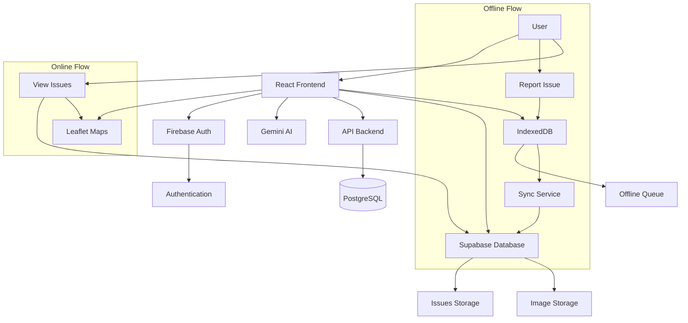

# JANSEVA-INFRA
## Civic Issue Reporting System


A comprehensive web application for citizens to report civic issues, track their status, and for authorities to manage and resolve them. Built with modern web technologies for offline-first functionality, real-time updates, and AI-powered priority assessment.

## 🚀 Tech Stack

<p align="center">
  
</p>

- **Frontend**: React 18, Vite
- **Styling**: Tailwind CSS, Material UI, Radix UI
- **Authentication**: Firebase Auth
- **Database**: Supabase (PostgreSQL)
- **Offline Storage**: IndexedDB
- **Maps**: Leaflet with React-Leaflet
- **Routing**: React Router
- **State Management**: React Context
- **HTTP Client**: Axios
- **AI Integration**: Google Generative AI (Gemini) for issue priority prediction
- **Icons**: Lucide React
- **Charts**: Recharts
- **Forms**: React Hook Form
- **Date Handling**: date-fns

## 📋 Features

- **Role-based Access Control**: Citizen, Engineer, Supervisor roles
- **Offline-First**: Issues can be reported offline and synced when online
- **Real-time Updates**: Live status tracking
- **AI-Powered Priority**: Automatic priority assessment using Gemini AI
- **Interactive Maps**: Visualize issues on maps
- **Image Uploads**: Attach photos to issues
- **Responsive Design**: Mobile-friendly interface
- **Dark/Light Theme**: Theme switching support

## 🏗️ Architecture Diagram



## 📸 Screenshots

### Landing Page


### Login Page


### Dashboard


### Report Issue


### My Issues


### Assigned Issues (Engineer)


### Map View


### Issue Details


## 🔧 Prerequisites

- **Node.js** (LTS version 18+ recommended)
- **npm** 
- **Firebase Project** with Authentication and Storage enabled
- **Supabase Project** with Database and Storage configured
- **Google AI API Key** (for Gemini integration)

## 📦 Installation

1. **Clone the repository**
   ```bash
   git clone <repository-url>
   cd "Civic Issue Reporting System"
   ```

2. **Install dependencies**
   ```bash
   npm install
   ```

3. **Environment Setup**
   Create a `.env` file in the project root:

   ```bash
   # API Configuration
   VITE_API_BASE_URL=http://localhost:5000/api

   # Firebase Configuration
   VITE_FIREBASE_API_KEY=your_firebase_api_key
   VITE_FIREBASE_AUTH_DOMAIN=your_project.firebaseapp.com
   VITE_FIREBASE_PROJECT_ID=your_project_id
   VITE_FIREBASE_STORAGE_BUCKET=your_project.appspot.com
   VITE_FIREBASE_MESSAGING_SENDER_ID=your_sender_id
   VITE_FIREBASE_APP_ID=your_app_id
   VITE_FIREBASE_MEASUREMENT_ID=your_measurement_id

   # Supabase Configuration
   VITE_SUPABASE_URL=https://your_project.supabase.co
   VITE_SUPABASE_ANON_KEY=your_supabase_anon_key

   # AI Configuration
   VITE_GEMINI_API_KEY=your_gemini_api_key
   ```

## 🚀 Usage

### Development
```bash
npm run dev
```
Vite will start the development server at `http://localhost:5173`

### Build for Production
```bash
npm run build
```

### Preview Production Build
```bash
npm run preview
```

### Windows PowerShell Note
If npm scripts fail with "running scripts is disabled":
```bat
cmd /c npm install
cmd /c npm run dev
```

## 🔍 About Technologies

### Firebase
Firebase provides authentication services and cloud storage:
- **Authentication**: User login/signup with email/password
- **Storage**: Stores user and issues information
- **Analytics**: Usage tracking and insights

Configuration in `src/firebase/config.js` initializes the Firebase app with environment variables.

### Supabase
Supabase provides file storage facility:
- **Storage**: Primary storage for issue images in the `issue-images` bucket

Configuration in `src/supabase/config.js` creates the Supabase client.

### IndexedDB
IndexedDB enables offline functionality:
- **Offline Storage**: Issues reported offline are queued in IndexedDB
- **Sync Service**: Automatically syncs pending issues when online
- **Data Persistence**: Local storage for better performance

Implementation in `src/utils/indexedDB.js` manages the offline queue with operations like add, get, delete, and clear synced issues.


